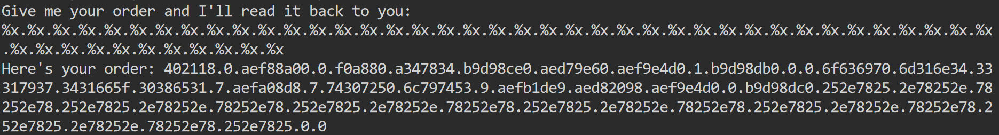
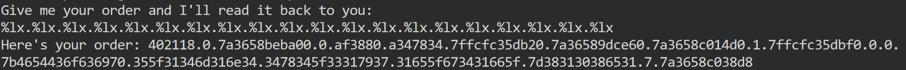

## format string 1

Level: Medium

Category: Pwn

Link: [https://play.picoctf.org/practice/challenge/434](https://play.picoctf.org/practice/challenge/434)

### Description

Patrick and Sponge Bob were really happy with those orders you made for them, but now they're curious about the secret menu. Find it, and along the way, maybe you'll find something else of interest!

Author: syreal

### Solution

The program will print out whatever user input with `printf`. So we can try to input a bunch of `%x`.



Notice that 14th to 18th hex strings look like ASCII characters. When we convert them, we get `ocipm1n431y741f_08e1`.

A weird thing to note is that some parts of the flag is missing, such as `CTF{`. This is because the program is 64-bit not 32-bit.

So, we need to use `%lx` instead because `%x` will only read 4 bytes.



Again, the 14th - 18th hex strings look like ASCII character. So we can try to convert them which gives `{FTCocip5_14m1n44x4_31y71e_g41f_}8108e1`.

This actually make sense since the `flag` array is 64 bytes below `secret2` array, which is 8 blocks/8 stack-lines.

> In some cases, this syntax can be used to easily overcome the space limitations that we have mentioned above. If we know that the canary is n stack-lines below the pointer to the format string, `%n$x` will print it directly on 32b systems, while `%(n + 5)$lx` will do the same on 64b ones.
> Reference: [https://lettieri.iet.unipi.it/hacking/format-strings.pdf](https://lettieri.iet.unipi.it/hacking/format-strings.pdf)

Finally, we can write a simple Python script to convert the flag from little endian to big endian.

```python
little_flag = "{FTCocip5_14m1n44x4_31y71e_g41f_}8108e1"
for i in range(0, len(little_flag), 8): # 64-bit system is 8 bytes per block
    print(little_flag[i:i+8][::-1], end="")
```

Flag: `picoCTF{4n1m41_57y13_4x4_f14g_e11e8018}`